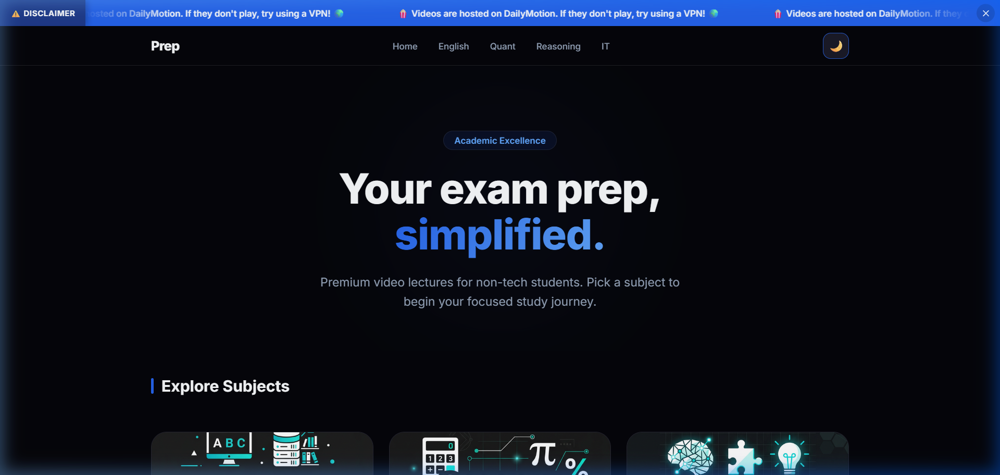
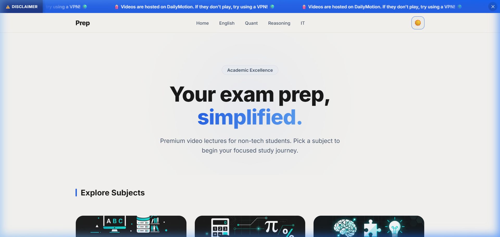
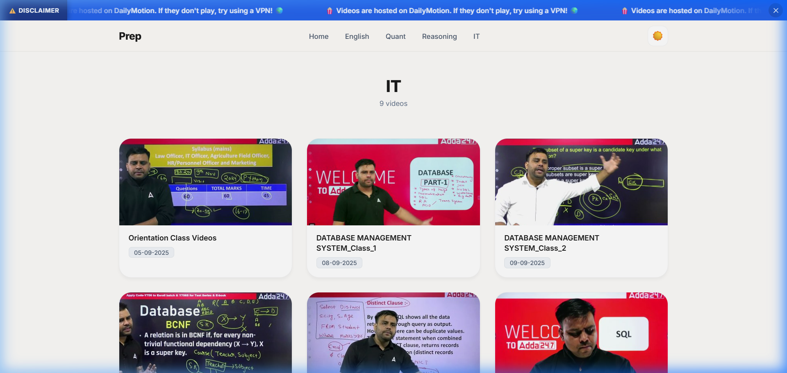
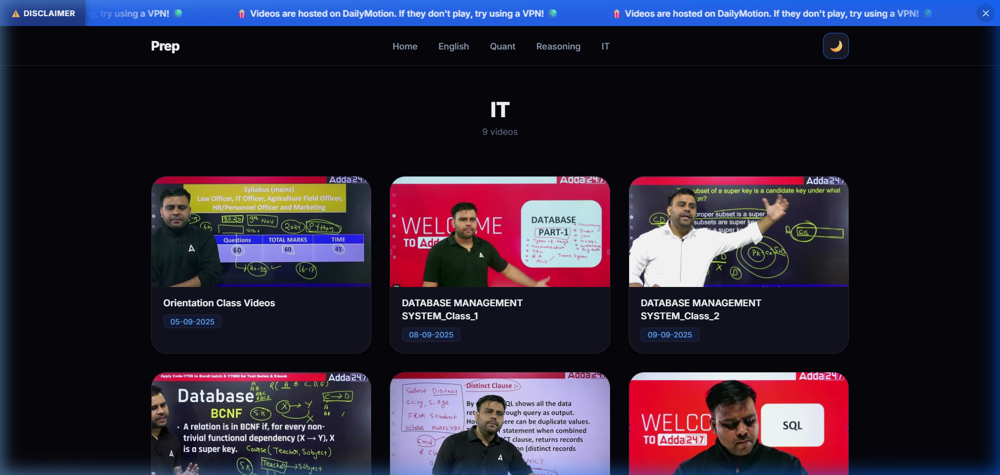

# 🎓 Prep — Exam Preparation Platform

A premium, minimal, and highly responsive web application designed for exam preparation. This platform features a curated selection of video lectures across various subjects, including IT, English, Quant, and Reasoning. 🚀

## ✨ Features

- **💎 Premium Aesthetics**: Sophisticated "Midnight" dark mode (default) and a clean "Parchment" light mode.
- **📱 Responsive Design**: Seamless experience across desktop and mobile devices.
- **📢 Marquee Notifications**: Dynamic marquee with a static disclaimer label and a functional close button.
- **🍱 Categorized Subjects**: Easy navigation between different study areas with beautiful Bento-style grid layouts.
- **✨ Glassmorphism**: Modern navigation bar with backdrop-blur effects.
- **🌓 Theming**: Persistent theme toggle that remembers user preferences.

## 🖼️ UI Gallery

### 🏠 Home Page

*Home Page - Dark Mode (Default)* 🌙

*Home Page - Light Mode* ☀️

### 📖 Subject Page (e.g., IT)

*Subject Page - Light Mode* ☀️

*Subject Page - Dark Mode* 🌙

## 📂 Project Structure

- `index.html`: The main landing page. 🏠
- `pages/subject.html`: Dynamic page for displaying video lectures for a specific subject. 📑
- `css/style.css`: Core design system, custom properties, and premium styling. 🎨
- `js/navbar.js`: Dynamic header, marquee, and navigation logic. 🛠️
- `js/videoData.js`: Centralized data for subjects and videos. 📂
- `js/script.js`: Main application logic and UI initialization. ⚙️

## 💻 Technology Stack

- **Frontend**: HTML5, Vanilla CSS3 (Custom Properties), Modern JavaScript (ES6+).
- **Typography**: Inter and Plus Jakarta Sans from Google Fonts.
- **Icons**: Custom SVG icons and Emoji symbols.

---
*Created with ❤️ for Exam Aspirants.*
